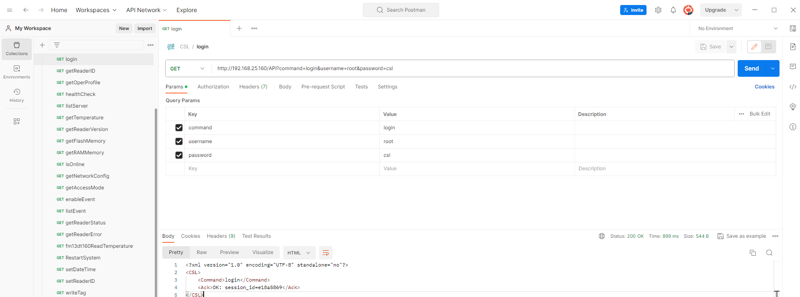

# Using CSL HTTP API for Accessing the Event Engine

You can send specific HTTP-POST command to the reader when running in the ```HTTP/XML``` mode.

All HTTP API commands are documented on the HTTP API specification [here](./CSL_Intelligent_Fixed_Reader_Network_HTTP_API.pdf).

There is also [Postman definiton file](./CSL.postman_collection.json) that can be imported into your [Postman Workspace](https://www.postman.com/) for demonstrating how to make the individual API calls.



